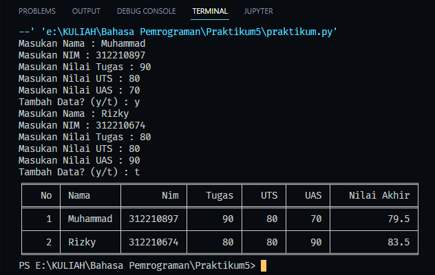

# Tugas Python Pertemuan 8
___
Nama    : Muhammad Rizky<br>
NIM     : 312210576<br>
Kelas   : TI.22.B2<br>
Mapel   : Bahasa Pemrograman<br>

**Daftar isi**
> * [Latihan Module 1](#latihan-module-1)
> * [Tugas Praktikum](#tugas-praktikum)

# `Pembukaan`
Pertama-tama buatlah sebuah Folder *Praktikum5* dan didalamnya diisi File *latihan.py & praktikum.py* seperti berikut :


>Note : /u penamaan file bisa di sesuaikan masing-masing

# `Latihan Module 1`
• Buat sebuah list sebanyak 5 elemen dengan nilai bebas<br>
• akses list:
> • tampilkan elemen ke 3
> • ambil nilai elemen ke 2 sampai elemen ke 4
> • ambil elemen terakhir
• ubah elemen list:
> • ubah elemen ke 4 dengan nilai lainnya
> • ubah elemen ke 4 sampai dengan elemen terakhir
• tambah elemen list:
> • ambil 2 bagian dari list pertama (A) dan jadikan list ke 2 (B)
> • tambah list B dengan nilai string
> • tambah list B dengan 3 nilai
> • gabungkan list B dengan list A

```python
    # -----------Buat sebuah list sebanyak 5 elemen dengan nilai bebas--------------
    print("Buat sebuah list sebanyak 5 elemen dengan nilai bebas")
    listA = [1, 2, 3, 4, 5]
    print(listA)
    print()

    print("* akses list: *")
    print ("tampilkan element ke 3 = ", listA[2])
    print ("ambil nilai elemen ke 2 sampai elemen ke 4 =",listA[1:4])
    print ("ambil elemen terakhir = ",listA[-1])
    print()

    print("* ubah element list: *")
    listA[3] = True
    print ("ubah elemen ke 4 dengan nilai lainnya = ", listA )
    listA[3:] = [6, 7]
    print ("ubah elemen ke 4 sampai dengan elemen terakhir = ", listA )
    print()

    print("* tambah elemen list: *")
    listB=[]
    listB.extend(listA[0:2])
    print ("ambil 2 bagian dari list pertama (A) dan jadikan list ke 2 (B) = ", listB )
    listB.extend(["tiga"])
    print ("tambah list B dengan nilai string = ", listB )
    listB.extend([4,5,6])
    print ("tambah list B dengan 3 nilai = ", listB )
    c=listA+listB
    print ("gabungkan list B dengan list A ", c )
   ```


# `Tugas Praktikum`
Buat program sederhana untuk menambahkan data kedalam sebuah list dengan rincian sebagai berikut:
> • Progam meminta memasukkan data sebanyak-banyaknya (gunakan perulangan)
> • Tampilkan pertanyaan untuk menambah data (y/t?), apabila jawaban t (Tidak), maka program akan menampilkan daftar datanya. • Nilai Akhir diambil dari perhitungan 3 komponen nilai (tugas: 30%, uts: 35%, uas: 35%)
> • Buat flowchart dan penjelasan programnya

## `Flowchart`

## `Code`
```python
    # import package tabulate
    from tabulate import tabulate

    # membuat list kosong untuk menampung data
    dataMahasiswa = []
    no = 0

    # melakukan perulangan input sesuai keinginan sampai pertanyaan tambah data dimunculkan kembali
    while(True):
    # membuat variable untuk menampung inputan
        no += 1
        nama = input("Masukan Nama : ")
        nim = input("Masukan NIM : ")
        tugas = float(input("Masukan Nilai Tugas : "))
        uts = float(input("Masukan Nilai UTS : "))
        uas = float(input("Masukan Nilai UAS : "))
        
    # menjumlahkan nilai dari tugas,uts dan uas
        nilaiAkhir = (tugas * 30 / 100) + (uts * 35 / 100) + (uas * 35 / 100)

    # menambahkan data input ke list dataMahasiswa
        dataMahasiswa.append(
            [no, nama, nim, tugas, uts, uas, nilaiAkhir])

    # input tambah data jika tekan y maka input kembali, selain itu berhenti dan tampilkan data
        tambahData = input("Tambah Data? (y/t) : ")
        if(tambahData == "t"):
            break

    # tampilkan dataMahasiswa menggunakan tabulate package agar tampilan berbentuk table

    print(tabulate(dataMahasiswa, headers=[
        "No", "Nama", "Nim", "Kelas", "Mata Kuliah", "Tugas", "UTS", "UAS", "Nilai Akhir"], tablefmt="fancy_grid"))
```
## `Hasil`
